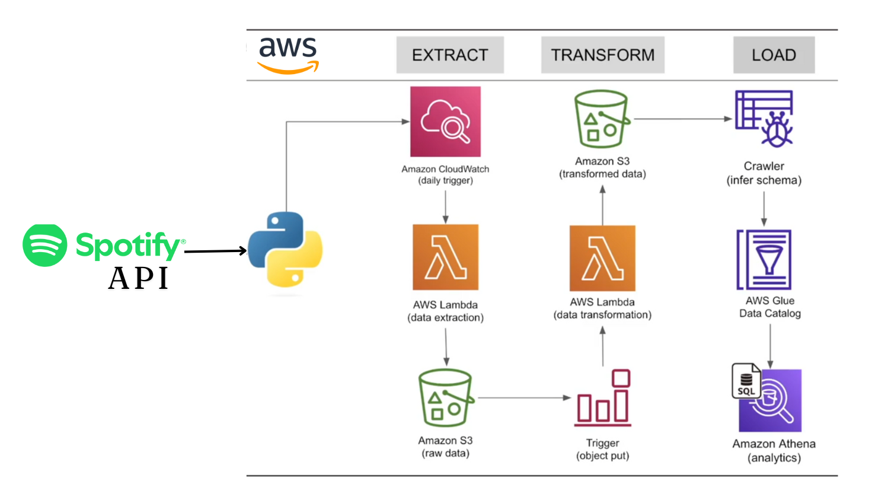

# Spotify ETL Pipeline 🎵🚀

## Overview
This project implements an Extract, Transform, Load (ETL) pipeline using AWS services to fetch data from the Spotify API, process it, and store it for analytical purposes.

## 🏗️ Architecture
The pipeline follows a structured ETL process:
1. **Extract:** AWS Lambda extracts data from the Spotify API.
2. **Transform:** The extracted data is processed and structured using AWS Lambda.
3. **Load:** Transformed data is stored in Amazon S3, with schema inference using AWS Glue, enabling querying through Amazon Athena.

### 🖼️ Architecture Diagram


## 🛠️ Tech Stack
- **AWS Services:** Lambda, S3, Glue, Athena, CloudWatch
- **Programming Language:** Python 🐍
- **Spotify API:** Spotipy Library 🎶
- **Data Processing:** Pandas, JSON

## 📁 Folder Structure
```
spotify-etl-project/
├── spotify_api_extract.py      # Extract data from Spotify API and upload to S3
├── spotify_transformation_load_function.py  # Process and load data into S3
├── architecture.png            # Architecture diagram
├── README.md                   # Project documentation
```

## ☁️ AWS Components
- **Amazon CloudWatch**: ⏰ Triggers the Lambda function to extract Spotify data on a schedule.
- **AWS Lambda (Extraction)**: 🏗️ Fetches raw playlist data from the Spotify API and stores it in S3.
- **Amazon S3 (Raw Storage)**: 📦 Stores extracted JSON data.
- **AWS Lambda (Transformation)**: 🔄 Processes and structures the data into tables (Albums, Artists, Songs).
- **Amazon S3 (Processed Storage)**: 📂 Stores the transformed CSV data.
- **AWS Glue Crawler**: 🔍 Infers the schema of transformed data.
- **AWS Glue Data Catalog**: 📖 Stores metadata for querying in Athena.
- **Amazon Athena**: 📊 Enables SQL-based querying of processed Spotify data.

## ⚙️ How It Works
1. **🛠️ Extraction**
   - The extraction Lambda function (`spotify_api_extract.py`) is triggered by Amazon CloudWatch.
   - It fetches data from the Spotify API using Spotipy and uploads it to S3 in JSON format.

2. **🔄 Transformation**
   - The transformation Lambda function (`spotify_transformation_load_function.py`) is triggered when a new object is uploaded to S3.
   - It processes the JSON data into structured tables (Album, Artist, Songs) using Pandas.
   - The transformed data is stored as CSV files in a different S3 location.

3. **📥 Loading and Querying**
   - AWS Glue Crawler scans the transformed data and updates the AWS Glue Data Catalog.
   - The data can be queried using SQL in Amazon Athena.

## 🛠️ Error Faced and Fixes
### ❌ Not Able to Create Crawler in AWS Glue
- While creating a crawler in AWS Glue to process my data for querying in Athena, I encountered an error stating, *"My account has declined to create crawler"*.

#### ✅ How I Fixed It:
🔹 Read AWS documentation 📜
🔹 Searched for the error message on Google, ChatGPT, and YouTube 🎥
🔹 Found out that many users faced the same issue and followed the forum discussions 📌
🔹 Ensured:
   - IAM permissions were correctly assigned 🔑
   - S3 and Glue were in the same region 🌎
   - No pending AWS bills 💵
🔹 As a last resort, I contacted AWS Support 📞, raised a ticket, and after 48 hours of communication (they were great! 🎉), I was able to fix the issue.

## 🚀 Setup and Deployment
### Prerequisites
- AWS Account with IAM permissions for Lambda, S3, Glue, and Athena.
- Spotify Developer Account and API credentials.
- Python 3.x and required dependencies (`spotipy`, `boto3`, `pandas`).

### Deployment Steps
1. Create an S3 bucket for raw and processed data.
2. Set up AWS Lambda functions with appropriate IAM roles.
3. Configure CloudWatch triggers for automation.
4. Deploy AWS Glue Crawler and Data Catalog.
5. Query data using Athena.

